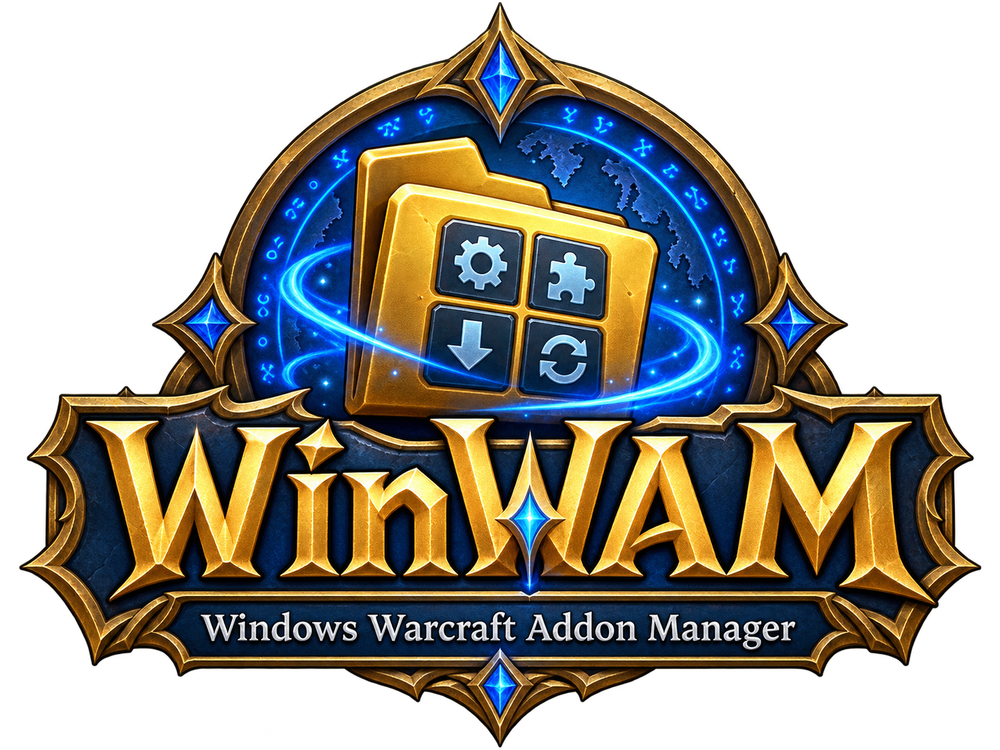

<div align="center">

### ✨ Brian’s Vibe-Coded Manifesto ✨

## Build. Learn. Grow.

<table align="center">
<tr>
<td align="left">
<ul>
<li><strong>AI is a tool.</strong> Use it thoughtfully and verify what it produces.</li>
<li><strong>Build boldly.</strong> Keep safety, reliability, and usability in mind.</li>
<li><strong>Learn openly.</strong> Welcome expertise, feedback, and correction.</li>
<li><strong>Grow together.</strong> Share knowledge and treat people with kindness.</li>
<li><strong>No jerks.</strong> Leave hostility, ego, and gatekeeping at the door.</li>
<li><strong>No shame.</strong> Be honest about what you know and how you build.</li>
</ul>
</td>
</tr>
</table>

---



**A native Windows application for browsing and managing World of Warcraft addons.**

Built in Rust with [`windows-reactor`](https://crates.io/crates/windows-reactor)
and WinUI 3.

</div>

> [!IMPORTANT]
> WinWam is in early development. Browsing works, but installing, updating, and
> uninstalling addons are not implemented yet.

## Features

- Native Windows 11-style WinUI 3 interface
- SKU-specific colors and official artwork
- Retail, Mists of Pandaria Classic, Classic, Burning Crusade Anniversary, and
  Forever support
- Automatic detection of standard World of Warcraft installation folders
- Folder selection and SKU-specific path validation
- Live, flavor-specific addon directories loaded from GitHub
- Search by addon name, author, category, and tag
- Category filters and sorting by name, author, or category
- Browse, Installed, Loadouts, and Settings pages
- Debug-only fallback directory for offline development

## Getting started

### Requirements

- Windows 11
- [Rust](https://rustup.rs/) with the stable MSVC toolchain
- Visual Studio 2022 Build Tools with **Desktop development with C++**
- Windows 10 or 11 SDK
- Windows App SDK runtime required by `windows-reactor`

### Run from source

```powershell
cargo run
```

### Build a release

```powershell
cargo build --release
```

The executable is written to `target/release/winwam.exe`.

### Build and deploy locally

The deployment script creates `C:\apps\WinWam` when needed and copies
`WinWam.exe`, `README.md`, and `LICENSE` into it:

```powershell
.\release.ps1
```

If WinWam is already running, close it before redeploying.

### Logging

WinWam writes errors and unhandled panics to `error.txt` beside the executable.
Debug builds also append diagnostic events to `log.txt`. To enable diagnostic
logging in a release build, set `WINWAM_DEBUG_LOG=1` before launching WinWam.
Log files are created only when there is something to write.

## Current limitations

The following screens and controls are present, but their underlying addon
management workflows are still planned:

- Installing addons
- Updating and uninstalling addons
- Scanning locally installed addons
- Downloading addon releases
- Persisting settings between launches
- Creating and applying real loadouts
- Checking for updates

## Addon directory

WinWam loads flavor-specific manifests from the public
[`bitobrian/wow-addons-directory`](https://github.com/bitobrian/wow-addons-directory)
repository:

| Game version | Manifest |
| --- | --- |
| Retail | `addons.retail.json` |
| Mists of Pandaria Classic | `addons.mop-classic.json` |
| Classic | `addons.classic.json` |
| Burning Crusade Anniversary | `addons.bc-anniversary.json` |
| Forever | `addons.forever.json` |

Directory files follow the upstream `addons.schema.json` contract. Each addon
entry identifies its source repository, category, and searchable tags.

Debug builds embed
[`data/addon-sources-fake.json`](data/addon-sources-fake.json) as a development
fallback. Its repositories and authors are synthetic placeholders. Release
builds do not embed fake directory data; they display an empty list and the
fetch error when the live directory is unavailable.

When changing the format, update the schema version and preserve loader
compatibility where practical.

## Development

### VS Code

Install the recommended workspace extensions:

- `rust-lang.rust-analyzer`
- `ms-vscode.cpptools`

Open the repository, select **WinWam Rust: Debug**, and press `F5`. The launch
configuration builds the debug executable and starts the native `cppvsdbg`
debugger.

Available tasks under **Terminal → Run Task**:

- `WinWam Rust: Build`
- `WinWam Rust: Build Release`
- `WinWam Rust: Check`

### Local development harness

Create synthetic WoW installations, installed addons, and flavor-specific directory manifests with:

```powershell
.\scripts\setup-dev-harness.ps1 -Reset
cargo run
```

The generated `local-test/` directory is ignored by Git. Addon folders are empty by default;
pass `-WithInstalledAddons` when installed-addon fixtures are needed. Debug builds automatically
prefer `local-test/World of Warcraft` and `local-test/directory`; release builds never use the
harness. Delete the folder or rerun the setup script with `-Reset` whenever a clean fixture is needed.

### Branding and artwork

Original application branding lives in `assets/icon.png` and
`assets/logo.png`. Regenerate the multi-resolution Windows icon with:

```powershell
.\scripts\prepare-app-assets.ps1
```

Ribbon category artwork lives in `assets/ribbon-bar/`. Regenerate the app-sized icons with:

```powershell
.\scripts\prepare-ribbon-assets.ps1
```

Original Blizzard SKU artwork lives in `assets/official-blizzard/`. Regenerate
the trimmed, app-sized copies with:

```powershell
.\scripts\prepare-official-assets.ps1
```

Generated artwork is checked in because it is embedded directly into the
executable.

### Repository layout

| Path | Purpose |
| --- | --- |
| `src/` | Rust application and theme source |
| `data/` | Development directory data and schema |
| `assets/` | Application branding, SKU artwork, and generated images |
| `scripts/` | Developer asset-preparation scripts |
| `poc/` | Early interface mockups and visual references |
| `.github/workflows/` | GitHub Actions release automation |
| `.vscode/` | Shared build and native-debug configuration |

## Publishing a release

Run the **Build and release** workflow from the repository's **Actions** tab.
You may provide a tag such as `v0.1.0` and choose whether the release is a
prerelease.

If the tag is blank, the workflow uses the package version from `Cargo.toml`.
It builds a locked Windows x64 release, packages the executable with the README
and license, uploads the ZIP as a workflow artifact, and creates or updates the
matching GitHub Release. Re-running the workflow for the same tag replaces its
ZIP.

## Project status

WinWam is experimental and pre-1.0. APIs, file formats, visuals, and behavior
may change as the real addon-management workflows are implemented.

## Stats for Nerds

Latest observed idle resource consumption:

- **Release binary:** 4 MB
- **Idle memory:** 52.5 MB

<sub>Point-in-time measurements; results may vary by build and system.</sub>
