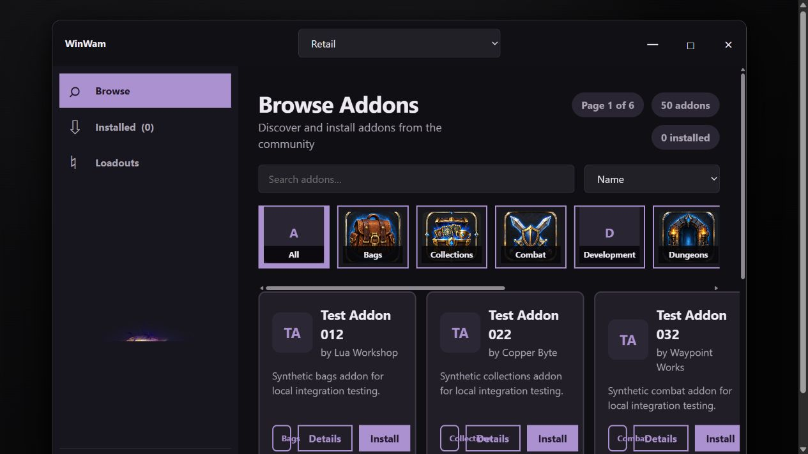
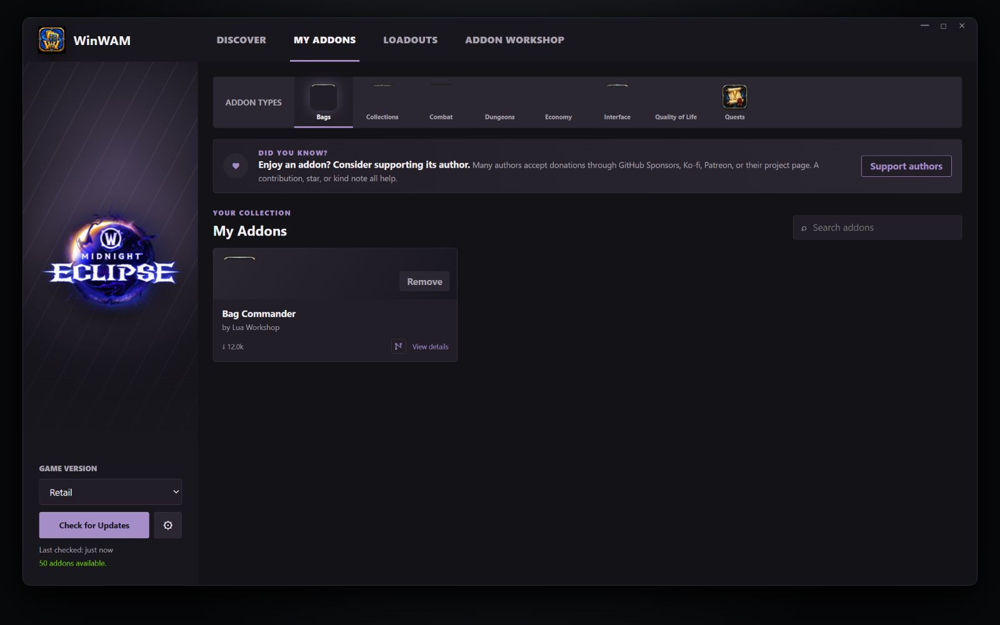

# WinWAM interface proof of concept

| Before | After |
| --- | --- |
|  |  |

- `before/` preserves the current desktop interface as a standalone HTML mock.
- `after/` contains the approved vNext design direction and interactive Workshop concepts.
- `before.png` and `after.png` are rendered browser captures of those mocks.

Open either `index.html` file directly in a browser to use its mock interactions.
